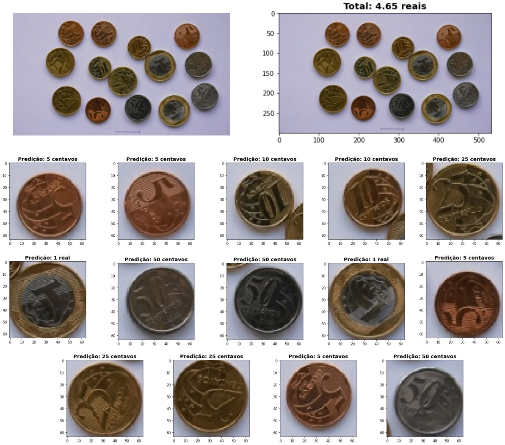

# Classificação de Moedas Brasileiras

**Disciplina**: Tópicos Especiais em Programação (Deep Learning) - Professor Diego Dorgam.

**Tópicos**: deep learning, redes neurais convolucionais, classificação de moedas brasileiras, visão computacional, histograma de gradientes orientados.

## Sobre o Projeto

Historicamente, a utilização de cédulas e moedas tem sido uma atividade essencial para o convívio em sociedade, entretanto, não são todas as pessoas que possuem habilidade para manuseá-las. Nesse sentido, especialmente pessoas idosas, analfabetas ou com baixa visão sofrem **dificuldades para gerir valores monetários em moedas**, o que ocasionalmente decorre em enganos ou confusões quando utilizadas no cotidiano.

Com o propósito de ser um passo inicial na resolução da problemática, além de uma automação no processo de contagem de moedas em larga escala, o projeto destina-se a realizar a **extração e a classificação de moedas em imagens** através de técnicas de visão computacional e deep learning de modo a **informar ao usuário o valor monetário total** observado na imagem.

## Sobre a Solução



A resolução do problema de classificação de moedas em imagens foi alcançado com base nos seguintes passos:

1. Desenvolvimento do detector de moedas `coin_detector.svm` baseado em **Histograma de Gradientes Orientados (HOG)** com a biblioteca `dlib`;
2. Desenvolvimento do script `generate_dataset.py` para cortar moedas de imagens maiores e salvá-las em dimensão 64x64;
3. Composição de datasets de moedas com a utilização do script `generate_dataset.py` para gerar o [dataset final](https://github.com/deeplearningunb/deep-coin/tree/main/datasets/generated_datasets/larger_back_and_front) com um grande número de moedas em diferentes situações gráficas;
4. Desenvolvimento da **Rede Neural Convolucional** e realização de testes com os datasets localizados em `datasets/generated_datasets/`. Melhores resultados obtidos no [dataset final](https://github.com/deeplearningunb/deep-coin/tree/main/datasets/generated_datasets/larger_back_and_front);
5. **Cálculo de quantia total monetária em imagens** através do recorte da moeda citado no item 1 e da classificação individual de cada moeda citado no item 4.
## Execução do Projeto

Para executar o projeto, será necessário:

*   Instalar o [Jupyter Notebook](https://jupyter.org/).
*   Instalar as dependências do projeto localizados no arquivo `requirements.txt` (Jupyter Notebook já configurado para instalar essas dependências).

Com a sua `env` de preferência, execute:

```ssh
jupyter-notebook contador_moedas.ipynb
```

## Instruções de Uso

Na aba `Kernel` do Jupyter Notebook, escolha a opção `Restart & Run All`.

## Autores

|Matrícula | Estudante |
| -- | -- |
| 17/0070735 | Lucas Maciel Aguiar |
| 16/0013321 | Luciano dos Santos Silva |
| 17/0024121 | Welison Lucas Almeida Regis |

## Referências

[1] REGIS, Welison. **Extração de moedas com técnicas de visão computacional (Modelo II)**. Disponível em: <https://github.com/WelisonR/contador_moedas>. Acesso em: 14 nov. 2020.

[2] BERTOZZI, M. et al. **A Pedestrian Detector Using Histograms of Oriented Gradients and a Support Vector Machine Classifier**. IEEE  Intelligent Transportation Systems Conference, [s.l.], p.1-6, set. 2007. IEEE.

[3] KERAS. Keras - API Reference. Disponível em: <https://keras.io/api/>. Acesso em: 14 nov. 2020.
